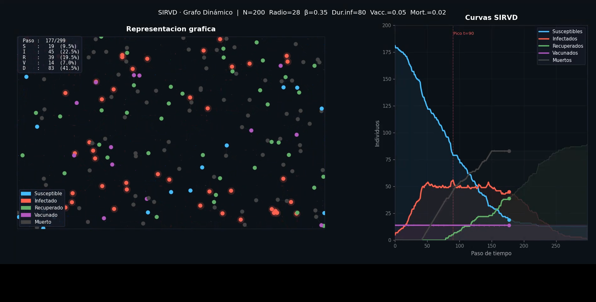

# Simulación de epidemias en grafos dinámicos

Proyecto en Python que simula la propagación de una enfermedad en una población de agentes móviles. En cada paso, los agentes cercanos se conectan temporalmente; esas conexiones forman un grafo dinámico por el que puede transmitirse la infección.

El resultado es una animación que muestra la población, los contactos activos y la evolución de cada grupo a lo largo del tiempo.

## Modelo SIRVD

Cada agente pertenece a uno de estos estados:

- **S — Susceptible:** puede contraer la enfermedad.
- **I — Infectado:** puede transmitirla al entrar en contacto con una persona susceptible.
- **R — Recuperado:** ha completado el periodo de infección.
- **V — Vacunado:** no participa en la transmisión.
- **D — Fallecido:** deja de moverse y de participar en la dinámica.

La simulación comienza con una cantidad definida de personas infectadas y vacunadas. En cada paso, los agentes se mueven, se detectan los contactos dentro del radio configurado y se aplican las probabilidades de contagio, vacunación y mortalidad. Los infectados se recuperan al cumplir la duración de la infección.

## Ejecución

Requiere Python y `ffmpeg` disponible en el sistema para exportar el video.

```bash
pip install -r requirements.txt
python main.py
```

Al finalizar, se genera la animación en `outputs/sirvd_dinamico.mp4` y se informa en consola el pico de personas infectadas.

## Configuración

Los parámetros principales están en `graph_simulation/config.py`:

- tamaño de la población y del área de simulación;
- velocidad de los agentes y radio de contacto;
- probabilidad de transmisión y duración de la infección;
- cantidad inicial de infectados y vacunados;
- tasa de vacunación, mortalidad y número de pasos.

Puedes modificar estos valores para comparar distintos escenarios epidemiológicos.

## Captura de pantalla


